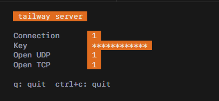
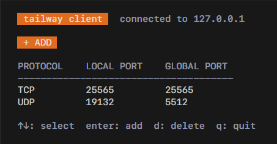

<div align="center">

# tailway

**Self-hosted reverse tunnel. TCP & UDP.**

[](https://go.dev)
[](LICENSE)
[](https://github.com/kiiimatz/tailway/releases)

</div>

---

Expose services behind NAT or firewalls to the public internet — no third-party servers, no accounts, no config files. Just a binary, a key, and a terminal.

---

## How it works

```
[ your machine ]                [ public server ]             [ internet ]
  local service ──── tunnel ──▶  tailway server ◀─────────── anyone
  :25565                          :25565 (public)
```

The client connects to the server over a persistent control channel, registers tunnels, and all incoming traffic is proxied back transparently. Both TCP and UDP are supported.

---

## Features

- TCP & UDP tunneling
- Key-based authentication
- Multiple tunnels per client
- Interactive terminal UI
- Debug mode (`--debug`)
- Single binary — no config, no daemon

---

## Installation

```bash
git clone https://github.com/kiiimatz/tailway.git
cd tailway
go build -o tailway ./cmd/tailway
```

> Requires Go 1.21+. Pre-built binaries available on [Releases](https://github.com/kiiimatz/tailway/releases).

---

## Usage

### Server

```bash
tailway server
tailway server --port 8000
tailway server --debug
```

On launch, you'll be prompted for an authentication key. Once entered, the server starts and displays live stats:

```
  tailway server

  Connection      1
  Key             ************
  Open UDP        0
  Open TCP        2
```



| Flag | Default | Description |
|------|---------|-------------|
| `--port` | `7000` | Control port (data port = port + 1) |
| `--debug` | off | Enable verbose logging |

---

### Client

```bash
tailway client
```

Enter your server address and key to connect, then manage tunnels interactively:

```
  tailway client  connected to 203.0.113.1:7000

  + ADD

  PROTOCOL    LOCAL PORT    GLOBAL PORT
  ──────────────────────────────────────
  TCP         25565         25565
  UDP         19132         19132

  ↑↓: select  enter: add  d: delete  q: quit
```



---

## Architecture

```
internal/
├── proto/          Wire protocol (JSON framing over TCP)
├── server/         Listeners, auth, tunnel registry, proxying
│   └── ui/         Server TUI
└── client/         Connection, tunnel state, event bus
    └── ui/         Client TUI
```

---

## License

[GPL-3.0](LICENSE) © kiiimatz
